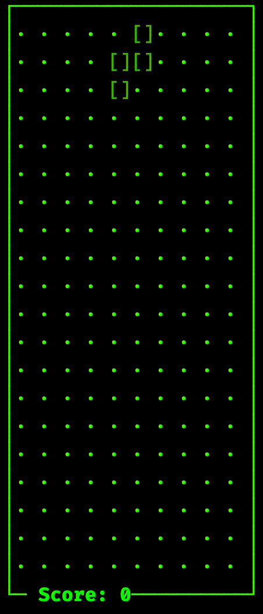

# tetris
Tetris on your terminal!

## Note
I'm still in the process of reading the rust book. The code quality is expected
to suck.

## TODOs
- [x] Implement falling bound check on left & right.
- [x] Implement fn to clear full line.
- [ ] Add extra score when down is pressed.
- [ ] Add GameState for losing. Currently the game just hangs with no losing state.
- [ ] Add levels? The falling rate goes up each level.
- [ ] Add help window in the UI.
- [ ] Add reset button.